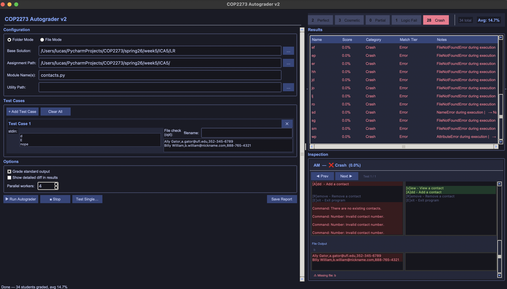

# COP2273 Autograder



A comprehensive, visually-driven Python autograder designed for the University of Florida programming class COP2273. Version 2.0 introduces a completely modernized interface, parallel execution, advanced interactive diffing, and support for file output verification.

## 🌟 Key Features

- **Modern Visual Interface:** A clean, responsive dark-themed GUI divided into intuitive workspaces (Configuration, Test Cases, Options, Results, and Inspection).
- **Parallel Workers:** Significantly speed up grading of large class sizes by running multiple student submissions concurrently.
- **Granular Evaluation Categories:** Grades are categorized logically—*Perfect, Cosmetic, Partial, Logic Fail,* and *Crash*—to give immediate insight into common failure points.
- **Advanced Inspection & Visual Diff:** Interactive side-by-side difference viewer that highlights exact missing or unexpected text in student outputs.
- **File Output Verification (File Check):** Along with standard output (stdout), the autograder can verify if a student's code correctly created/modified a specific file with expected contents.
- **Dual Mode Support:**
  - **Folder Mode:** For assignments with multiple student folders.
  - **File Mode:** For assignments with single self-contained Python files.
- **Targeted Module Testing:** Specify exactly which `Module Name(s)` to target within complex assignment paths.
- **Detailed Reporting:** Real-time progress bar, class averages, and exportable reports (Save Report).
- **Test Single Submission:** Isolate and test individual student submissions to debug tricky edge cases.

## 🚀 Requirements

- Python 3.8+ (Recommended)
- Appropriate GUI framework dependencies (listed in `requirements.txt`)
- Standard libraries: `pathlib`, `subprocess`

## ⚙️ Installation

1. Clone or download this repository.
2. Create and activate a virtual environment:
   ```bash
   python -m venv .venv
   source .venv/bin/activate  # On Windows use: .venv\Scripts\activate
   ```
3. Install dependencies:
   ```bash
   pip install -r requirements.txt
   ```

## 🖥️ Usage Guide

### 1. Configuration Panel
Set up the core parameters for the assignment:
- **Mode Toggle:** Select **Folder Mode** (each student has a directory) or **File Mode** (all student files are in one directory).
- **Base Solution:** The absolute path to the reference solution (the "answer key").
- **Assignment Path:** The path to the folder containing the student submissions.
- **Module Name(s):** The specific Python file to execute (e.g., `contacts.py`).
- **Utility Path:** (Optional) Folder containing helper scripts or datasets needed by the assignment to run properly.

### 2. Test Cases Panel
Define how the programs will be tested:
- Click **+ Add Test Case** to create a test scenario.
- **stdin:** Provide the exact user input the program should receive, pressing `Enter` for each new input prompt.
- **File check (opt):** If the assignment requires generating a file (e.g., writing to `contacts.txt`), enter the expected `filename` and the expected contents in the adjacent text box. The autograder will verify the file matches.

### 3. Options
- **Grade standard output:** Toggle whether stdout should factor into the grade calculation.
- **Show detailed diff in results:** Enable verbose difference logging for manual review.
- **Parallel workers:** Choose how many concurrent grading threads to use. Higher numbers grade faster but consume more CPU (e.g., `4`).

### 4. Running & Results
- Click **▶ Run Autograder**.
- The top-right **Results** table will populate in real-time. It lists the Student Name, Score, Match Category, Match Tier, and Exception Notes (e.g., `FileNotFoundError`).
- **Top summary bar:** Quick metrics on the number of Perfect vs Crash submissions, total graded, and the Class Average.

### 5. Inspection Panel
Select any student in the Results table to inspect their execution in detail:
- **Interactive Diff Viewer:** Red text denotes expected output that the student missed; Green text denotes extra output the student included.
- **Test Case Navigation:** Use the **◀ Prev** and **Next ▶** buttons to flip through their performance on individual test cases.
- **File Output:** A dedicated pane below the stdout diff shows any discrepancies in file-generation tasks (e.g., "Missing file:" or content mismatches).

## 🛠️ Extending and Debugging

- **Testing a Single Student:** If a student's code is crashing the grader or behaving weirdly, use the **Test Single...** button to run *only* their submission and view isolated traceback logs.
- **Grading Tolerances:** Look into the autograder core engine to adjust how strict the string-matching behaves (e.g., whitespace, punctuation, capitalization).
- **Custom Utility Modules:** Ensure any external modules or CSV files standard to the class are placed in the directory assigned to **Utility Path** so all student scripts can access them properly during execution test runs.

---
*Developed for standardizing and streamlining Python grading for COP2273.*
